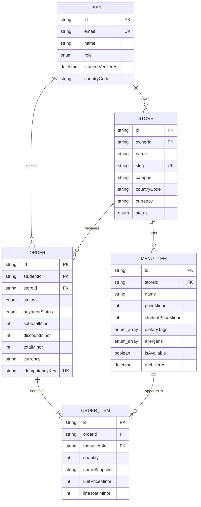

# FoodWise MVP Architecture

**Date**: 2026-09-23 | **Spec**: [spec.md](./spec.md) | **Plan**: [plan.md](./plan.md)

This document records the team's decisions for the MVP described in the spec's [MVP Scope](./spec.md#mvp-scope). Where it is simpler than [plan.md](./plan.md), this document wins for the MVP. The plan still describes the long-term direction.

## 1. Pages and routes

Route segments are kebab-case. Dynamic segments name the thing they hold (`[menuItemId]`, never `[id]`).

| Route | Page | Access | Target week |
| --- | --- | --- | --- |
| `/` | Home: search box, featured stores, today's student deals | Public | 04 |
| `/meals` | Browse and search all available meals; filter by campus, dietary tag, max price, store | Public | 04 |
| `/meals/[menuItemId]` | Meal detail: prices, dietary and allergen info, add to cart | Public (add to cart: verified student) | 05 |
| `/stores` | All published stores, filter by campus | Public | 05 |
| `/stores/[storeSlug]` | Store info, hours, pickup details, and its menu | Public | 05 |
| `/login` | Sign in | Guest | 05 |
| `/register` | Create account; a verified school email sets student eligibility | Guest | 05 |
| `/account` | Profile and eligibility status | Signed in | 05 |
| `/cart` | Review cart with server-calculated totals | Verified student | 05 |
| `/checkout` | Confirm pickup details and place the order | Verified student | 05 |
| `/orders` | My order history | Student (own orders) | 05 |
| `/orders/[orderId]` | Order status and receipt | Student (own order) | 05 |
| `/vendor` | Vendor dashboard: my stores, incoming orders | Vendor | 06 |
| `/vendor/stores/new` | Create a store | Vendor | 06 |
| `/vendor/stores/[storeId]` | Edit store; add, edit, archive menu items | Owning vendor | 06 |
| `/vendor/orders/[orderId]` | Advance order status, mark paid at pickup | Owning vendor | 06 |
| `/api/health` | Health check | Public | 04 |
| `/api/webhooks/stripe` | Stripe webhook (stretch) | Stripe signature | Stretch |
| `/tracker` | Food tracker (stretch, US7) | Student | Stretch |

### App Router layout

```text
app/
├── layout.tsx                      # fonts, SiteHeader, SiteFooter
├── page.tsx                        # /
├── not-found.tsx
├── error.tsx
├── (auth)/
│   ├── login/page.tsx
│   └── register/page.tsx
├── (shop)/                         # public browsing
│   ├── meals/page.tsx
│   ├── meals/[menuItemId]/page.tsx
│   ├── stores/page.tsx
│   └── stores/[storeSlug]/page.tsx
├── (student)/                      # layout checks for a verified student session
│   ├── account/page.tsx
│   ├── cart/page.tsx
│   ├── checkout/page.tsx
│   ├── orders/page.tsx
│   └── orders/[orderId]/page.tsx
├── vendor/                         # layout checks for the VENDOR role
│   ├── layout.tsx
│   ├── page.tsx
│   ├── stores/new/page.tsx
│   ├── stores/[storeId]/page.tsx
│   └── orders/[orderId]/page.tsx
└── api/
    └── health/route.ts
proxy.ts                            # Next 16 name for middleware; UX redirects only
```

Next.js 16 notes that affect this tree:

- `middleware.ts` is now `proxy.ts`. It only redirects signed-out users for convenience. Every page, Server Action, and Route Handler still checks the session itself.
- `params` and `searchParams` are Promises. Await them. Use the global `PageProps<'/meals/[menuItemId]'>` and `LayoutProps` helpers for types.

### Shared server code

The plan's full `src/domain` layer is deferred. The MVP uses a lighter tree:

```text
src/
├── auth/            # Better Auth config, getSession(), requireUser(), requireVerifiedStudent(), requireVendor()
├── db/client.ts     # single Prisma client
├── server/
│   ├── queries/     # read functions used by Server Components: getMeals(), getStoreBySlug()
│   ├── actions/     # "use server" mutations: addToCart(), placeOrder(), saveMenuItem()
│   └── policies/    # ownership checks: assertOwnsStore()
├── validation/      # Zod schemas: menuItemSchema, registerSchema
├── lib/money.ts     # formatMoney(amountMinor, currency, locale), toMinor(), sumMinor(); integers only
└── components/      # see section 2
prisma/
├── schema.prisma
├── migrations/
└── seed.ts
tests/
├── unit/ integration/ e2e/
```

## 2. Components

### Where components live

```text
src/components/
├── ui/        # shadcn/ui primitives: Button, Input, Label, Select, Checkbox, Badge, Card, Alert, Dialog, Sheet, Skeleton
├── layout/    # SiteHeader, SiteFooter, MainNav, MobileNav, UserMenu, CartButton, PageHeader, Container
├── meals/     # MealCard, MealGrid, FilterBar, PriceTag, DietaryTags, AllergenList, AvailabilityBadge
├── stores/    # StoreCard, StoreHeader, StoreHours
├── cart/      # AddToCartForm, CartLineItem, CartSummary
├── orders/    # OrderCard, OrderStatusBadge, OrderSummary
├── vendor/    # StoreForm, MenuItemForm, MenuItemTable, IncomingOrdersTable
├── auth/      # LoginForm, RegisterForm, VerificationNotice
└── shared/    # EmptyState, Pagination, FormField, StatusMessage
```

Components used by one route only can sit next to that route in a `_components/` folder.

### Essential reusable components

| Component | Server or client | Purpose |
| --- | --- | --- |
| `SiteHeader` | Server (children are client where noted) | Logo, `MainNav`, `SearchBox`, `CartButton`, `UserMenu`. Sticky, 64px. Collapses into `MobileNav` below `md`. |
| `SiteFooter` | Server | Links, mission line, accessibility statement link. |
| `Container` | Server | `mx-auto max-w-page px-4 sm:px-6 lg:px-8` (1200px max) |
| `MealCard` | Server | Image, name, store, `PriceTag`, `DietaryTags`, `AvailabilityBadge`. Whole card is one link. |
| `MealGrid` | Server | Responsive grid of `MealCard`, with `EmptyState` when empty. |
| `FilterBar` | Client | Search, campus, dietary tags, max price. Writes to URL search params so results stay server-rendered and shareable. |
| `PriceTag` | Server | Base price, student price, and savings. Uses text labels as well as color. Takes minor-unit amounts plus a currency code. |
| `DietaryTags` / `AllergenList` | Server | Text badges with icons; never color alone. |
| `StoreCard` / `StoreHeader` | Server | Store summary and store page header. |
| `AddToCartForm` | Client | Quantity and submit; calls the `addToCart` Server Action. Handles the "cart has another store" dialog. |
| `CartSummary` | Server | Subtotal, student savings, total, all from the server. |
| `OrderStatusBadge` | Server | Status as text plus icon. |
| `MenuItemForm` / `StoreForm` | Client | Vendor forms using `useActionState` with field-level errors. |
| `LoginForm` / `RegisterForm` | Client | Auth forms using `useActionState`. |
| `EmptyState`, `StatusMessage`, `FormField` | Server | Shared feedback and form wrappers with `aria-live` and `aria-describedby`. |

### Component hierarchy

```mermaid
flowchart TD
    Root[RootLayout] --> Header[SiteHeader]
    Root --> Main[page content]
    Root --> Footer[SiteFooter]

    Header --> Logo
    Header --> MainNav
    Header --> SearchBox[SearchBox · client]
    Header --> CartButton[CartButton · client]
    Header --> UserMenu[UserMenu · client]
    Header --> MobileNav[MobileNav · client · Sheet]

    Main --> Home["/ HomePage"]
    Main --> Meals["/meals MealsPage"]
    Main --> MealDetail["/meals/[menuItemId]"]
    Main --> Store["/stores/[storeSlug]"]
    Main --> Cart["/cart"]
    Main --> Orders["/orders"]
    Main --> Vendor["/vendor/*"]

    Home --> StoreCard
    Home --> MealGrid

    Meals --> PageHeader
    Meals --> FilterBar[FilterBar · client]
    Meals --> MealGrid
    Meals --> Pagination
    MealGrid --> MealCard
    MealGrid --> EmptyState
    MealCard --> PriceTag
    MealCard --> DietaryTags
    MealCard --> AvailabilityBadge

    MealDetail --> PriceTag
    MealDetail --> AllergenList
    MealDetail --> AddToCartForm[AddToCartForm · client]
    MealDetail --> VerificationNotice

    Store --> StoreHeader
    StoreHeader --> StoreHours
    Store --> MealGrid

    Cart --> CartLineItem
    Cart --> CartSummary
    CartSummary --> PriceTag

    Orders --> OrderCard
    OrderCard --> OrderStatusBadge

    Vendor --> IncomingOrdersTable
    Vendor --> StoreForm[StoreForm · client]
    Vendor --> MenuItemTable
    Vendor --> MenuItemForm[MenuItemForm · client]
```



Every client component above is a leaf or near-leaf. Pages and layouts stay Server Components.

### Priority for the first implementation

1. **Foundation**: database, Prisma schema, seed data, CI. Everything else depends on it.
2. **Design system and shell**: theme tokens, fonts, shadcn/ui setup, `SiteHeader`, `SiteFooter`, `Container`.
3. **Discovery read path**: `getMeals()` query, `/meals` with `MealCard`, `MealGrid`, `FilterBar`, `PriceTag`, `DietaryTags`. This is the Week 04 demo.
4. Week 05: meal and store detail pages, auth, cart, checkout, orders.
5. Week 06: vendor dashboard and menu management.
6. Later: Stripe test mode, food tracker, accessibility audit, polish.

## 3. Data model

### Database decision

**PostgreSQL**, hosted on **Neon** (free tier, database branches for preview deployments, Vercel integration), accessed through **Prisma ORM**.

Why PostgreSQL over MongoDB: the data is relational (stores own menu items, orders reference items and stores), orders need transactions, and money rules need database constraints such as unique idempotency keys and non-negative totals.

Local development: each developer uses their own Neon branch, or Postgres in Docker. Never share one dev database across the team.

Setup as built (issue #9):

- Prisma 7 with the `prisma-client` generator, output to `src/generated/prisma` (git-ignored, generated by `npm install`).
- The app connects through `@prisma/adapter-pg` using `DATABASE_URL` (Neon's pooled URL). Migrations use `DATABASE_URL_UNPOOLED` (the direct URL), set in `prisma.config.ts`.
- Integration tests run against Postgres in Docker (`compose.yaml`, port 5433). The Vitest config refuses any non-localhost test database.
- FoodWise stores no passwords. Sign-in is passwordless (issue #16), so `User` has no `passwordHash`.

### Core entities

Five core entities. Every table has `id` (cuid), `createdAt`, and `updatedAt`.

Money is always an `Int` field ending in `Minor`: a count of the currency's smallest unit (cents for USD, pence for GBP, none for JPY). Every money amount travels with a `currency` code. A store's currency never changes once it has orders.

**User**

| Field | Type | Notes |
| --- | --- | --- |
| `email` | String, unique | Lowercased before save |
| `name` | String | |
| `role` | enum `STUDENT \| VENDOR \| ADMIN` | Default `STUDENT` |
| `studentVerifiedAt` | DateTime? | Set when the email domain is on the school allowlist. Null means unverified. |
| `countryCode` | String(2) | ISO 3166-1 alpha-2, chosen at registration; default `US`. Sets the default campus filter and the locale used to format prices. |

**Store**

| Field | Type | Notes |
| --- | --- | --- |
| `ownerId` | FK → User | Must be a `VENDOR` |
| `name` | String | |
| `slug` | String, unique | Used in `/stores/[storeSlug]` |
| `description` | String | |
| `campus` | String | e.g. "BYU Provo"; discovery filter |
| `address` | String | |
| `countryCode` | String(2) | ISO 3166-1 alpha-2, e.g. `US` |
| `currency` | String(3) | ISO 4217, e.g. `USD`; defaults from `countryCode`; locked once the store has orders |
| `hoursText` | String | Free text for the MVP, e.g. "Mon–Fri 11am–7pm" |
| `pickupAvailable` | Boolean | Default true |
| `deliveryAvailable` | Boolean | Default false; unused in MVP |
| `status` | enum `PENDING_REVIEW \| PUBLISHED \| SUSPENDED` | Only `PUBLISHED` stores are public |
| `imageUrl` | String? | |

**MenuItem**

| Field | Type | Notes |
| --- | --- | --- |
| `storeId` | FK → Store | |
| `name` | String | |
| `description` | String | |
| `category` | String | e.g. "Bowls", "Drinks" |
| `priceMinor` | Int | > 0, in the store's currency |
| `studentPriceMinor` | Int? | Must be < `priceMinor` when set |
| `dietaryTags` | enum[] `VEGETARIAN, VEGAN, GLUTEN_FREE, DAIRY_FREE, HALAL, KOSHER` | |
| `allergens` | enum[] `MILK, EGGS, FISH, SHELLFISH, TREE_NUTS, PEANUTS, WHEAT, SOY, SESAME` | The US "major 9" |
| `isAvailable` | Boolean | Vendor toggle for "sold out today" |
| `archivedAt` | DateTime? | Soft delete; archived items stay linked to past orders |
| `imageUrl` | String? | |

**Order**

| Field | Type | Notes |
| --- | --- | --- |
| `studentId` | FK → User | |
| `storeId` | FK → Store | One store per order |
| `status` | enum `PLACED \| PREPARING \| READY \| COMPLETED \| CANCELLED` | |
| `paymentStatus` | enum `UNPAID \| PAID \| REFUNDED` | MVP: vendor sets `PAID` at pickup |
| `fulfillment` | enum `PICKUP \| DELIVERY` | Always `PICKUP` in MVP |
| `subtotalMinor` | Int | Sum of base prices |
| `discountMinor` | Int | Student savings |
| `totalMinor` | Int | `subtotalMinor - discountMinor`, ≥ 0 |
| `currency` | String(3) | Copied from the store when the order is placed |
| `idempotencyKey` | String, unique | Generated when the checkout page renders; a repeated submit returns the existing order |
| `pickupNote` | String? | |
| `stripeCheckoutSessionId` | String?, unique | Stretch |
| `placedAt` | DateTime | |

**OrderItem** (join table between Order and MenuItem)

| Field | Type | Notes |
| --- | --- | --- |
| `orderId` | FK → Order | Cascade delete |
| `menuItemId` | FK → MenuItem | Restrict delete (archive instead) |
| `quantity` | Int | 1–20 |
| `nameSnapshot` | String | Item name when ordered |
| `basePriceMinor` | Int | Snapshot |
| `unitPriceMinor` | Int | Price actually charged (student or base) |
| `lineTotalMinor` | Int | `unitPriceMinor × quantity` |

### Relationships

- **User 1 → many Store**: a vendor owns stores.
- **Store 1 → many MenuItem**: a store's menu.
- **User 1 → many Order**: a student's orders.
- **Store 1 → many Order**: a store's incoming orders.
- **Order many ↔ many MenuItem**, through **OrderItem**, which also holds the price snapshot.



### Rules the database enforces

- Unique: `User.email`, `Store.slug`, `Order.idempotencyKey`, `Order.stripeCheckoutSessionId`.
- Indexes: `Store(status, campus)`, `MenuItem(storeId, isAvailable)`, `Order(studentId, placedAt)`, `Order(storeId, status)`.
- `placeOrder` runs in one transaction: re-read items, check availability and eligibility, compute totals, insert Order and OrderItems.
- Check constraints (add through a SQL migration): `priceMinor > 0`, `studentPriceMinor < priceMinor`, `quantity BETWEEN 1 AND 20`, `totalMinor >= 0`, `currency ~ '^[A-Z]{3}$'`.
- An order's `currency` must equal its store's `currency`; `placeOrder` sets it from the store, never from input.

### Later entities

Auth tables, added in issue #16: Better Auth's `Session`, `Account`, and `Verification`, plus `SecurityEvent`, the audit log for sign-in and access decisions. `SecurityEvent` stores a keyed hash of the email, never the address, and the per-email rate limits count these rows.

Added with their stories, not in the MVP schema: `WebhookEvent` (Stripe stretch), wider `AuditEvent` coverage (hardening), `FoodItem` and `ConsumptionLog` (tracker), and the support, loan, and sponsorship tables.

## 4. Design theme and branding

This section turns the design direction in [plan.md § Design System and UX Planning](./plan.md#design-system-and-ux-planning) into concrete tokens and Tailwind classes. It keeps plan.md's palette, fonts, spacing, and screen structure. Colors that fail WCAG AA as text get a darker text variant. The original color stays for fills and large elements.

### Personality

Warm, trustworthy, practical: a modern campus marketplace. Affordability is clear without looking discount-driven.

### Color palette

Token names follow shadcn/ui so its components pick up the theme. Tokens are defined in `app/globals.css` under `@theme`, so Tailwind classes such as `bg-primary` and `text-muted-foreground` work. Contrast ratios are computed against Shell (`#F6F3EE`) unless stated.

| Token | Hex | plan.md name | Use | Contrast |
| --- | --- | --- | --- | --- |
| `--background` | `#F6F3EE` | Background shell | Page background | — |
| `--card` | `#FFFFFF` | Surface cards | Cards, forms, order summaries | — |
| `--foreground` | `#1F2A27` | Neutral text | Headings and body text | 13.4:1 |
| `--muted-foreground` | `#5A6B66` | Muted text | Helper text, timestamps | 5.1:1 |
| `--border` | `#DCE4E0` | Border / subtle | Dividers, inactive states | decorative |
| `--primary` | `#1F7A5A` | Primary brand | Buttons, links, focus ring | 5.3:1 with white text; 4.8:1 as text |
| `--primary-hover` | `#17634A` | (new) | Hover and active | 7.2:1 with white text |
| `--primary-dark` | `#123C32` | Primary dark | Navigation, header text, strong emphasis | 11.0:1 |
| `--secondary` | `#E3F1EA` | (new) | Selected filter chips, subtle fills | primary text on it: 4.5:1 |
| `--deal` | `#F6B94A` | Accent warmth | Student-price badge **background** | `--foreground` text on it: 8.4:1 |
| `--promo` | `#E96F3D` | Secondary accent | Promo chip fills, icons, borders, text 24px and larger | 3.1:1 (large text and graphics only) |
| `--promo-text` | `#AF532E` | (AA variant) | Orange text at normal sizes | 4.6:1 |
| `--success` | `#287C55` | Success (was `#2D8A5F`, 4.3:1 on white) | Confirmations, verified status | 4.6:1 |
| `--warning` | `#9E5F1F` | Warning (was `#D9822B`, 2.9:1 on white) | Expiry, pending, low stock | 4.6:1 |
| `--destructive` | `#BB4646` | Error (was `#C54A4A`, 4.3:1 on Shell) | Validation errors, failed payments | 4.7:1 |

Rules:

- Amber (`--deal`) is never text or an icon on a light background (1.8:1). Use it only behind dark text.
- Green is the default brand and trust color. Amber is only for price and student-benefit emphasis.
- Status is never shown by color alone. Pair it with text and an icon.
- Light theme only for the MVP. Tokens are structured so a dark theme can be added by redefining them.

### Typography

| Role | Font | Tailwind | Notes |
| --- | --- | --- | --- |
| Headings | **Plus Jakarta Sans** (700, 800) | `font-display` | plan.md offered Manrope or Plus Jakarta Sans; we picked one so every page matches |
| Body and UI | **Inter** (400, 500, 600) | `font-sans` | Replaces the starter's Geist in `app/layout.tsx` |
| Prices | Inter | `tabular-nums font-semibold` | Lines up like monospace but reads naturally on meal cards |
| Order numbers, IDs | **JetBrains Mono** | `font-mono` | Technical labels only |

All three load through `next/font/google`.

Type scale (from plan.md):

| Level | Size | Tailwind |
| --- | --- | --- |
| Display / hero | 40–48px, 800 | `text-[2.5rem] md:text-5xl font-extrabold tracking-tight` |
| H1 | 32–36px, 700 | `text-[2rem] md:text-4xl font-bold` |
| H2 | 24–28px, 700 | `text-2xl md:text-[1.75rem] font-bold` |
| H3 | 20–22px, 600 | `text-xl font-semibold` |
| Body | 16px, line height 1.5 | `text-base leading-normal` |
| Small label | 12–14px, 500–600 | `text-sm font-medium`; `text-xs` only for short badges |

Fix during setup: `app/globals.css` currently sets `font-family: Arial` on `body`, which overrides the theme font. Remove it.

### Layout and spacing

- Mobile-first. Tailwind default breakpoints: `sm` 640, `md` 768, `lg` 1024, `xl` 1280.
- Max content width 1200px: define `--container-page: 75rem` in `@theme` and use `max-w-page`.
- Page container: `mx-auto max-w-page px-4 sm:px-6 lg:px-8`.
- Desktop layouts use a 12-column grid (`lg:grid-cols-12`) where a page needs a sidebar, e.g. filters or vendor navigation.
- Meal grid: `grid gap-4 sm:grid-cols-2 lg:grid-cols-3 xl:grid-cols-4 sm:gap-6`.
- Spacing scale from plan.md, 4, 8, 12, 16, 20, 24, 32, 40, 48px, maps to Tailwind steps 1, 2, 3, 4, 5, 6, 8, 10, 12. Use only these. Section rhythm is `py-8 md:py-12`.
- Radius: `--radius: 0.75rem`. Cards `rounded-xl`, inputs and buttons `rounded-lg`, badges and chips `rounded-full`.
- Elevation: white cards with `border` and `shadow-sm` on the Shell background. Nothing heavier.
- Header: sticky top bar, `h-16`, white, bottom border, `primary-dark` text. Mobile nav opens in a `Sheet`. plan.md also allows a bottom nav on mobile; revisit after the first usability test.
- Vendor dashboard: left-hand navigation from `lg` up, a `Sheet` below that.
- Page content follows plan.md's "Primary Screen Structure".
- Forms: one column, label above input, helper and error text below, submit button full-width on mobile.
- Touch targets are at least 44×44px. Focus ring: `focus-visible:outline-2 focus-visible:outline-offset-2 focus-visible:outline-primary`.

### UI library

- **Tailwind CSS v4** utilities for all styling. Custom CSS only for tokens in `globals.css`.
- **shadcn/ui** for accessible interactive primitives (Dialog, Sheet, DropdownMenu, Select, Checkbox, Toast). Components are copied into `src/components/ui/` and owned by the team. Configure `components.json` aliases to `@/src/components` and `@/src/lib`.
- **lucide-react** icons. Decorative icons get `aria-hidden="true"`; icon-only buttons get an `aria-label`.
- Images through `next/image` with meaningful `alt` text for meals, empty `alt` for decorative images.
